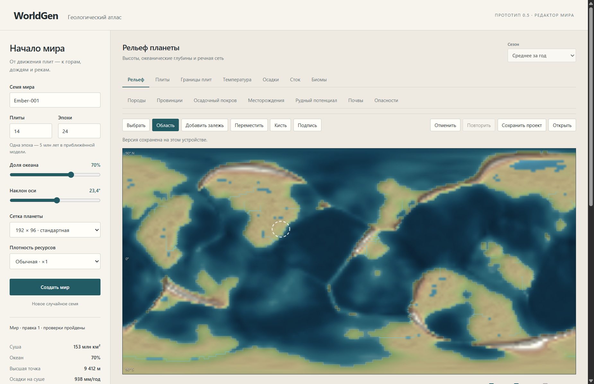

# WorldGen

Генератор фэнтезийных миров и редактор карт для Windows на Tauri 2. WorldGen строит рельеф, климат, речную сеть, геологию и ресурсные тела, затем позволяет менять мир вручную с предпросмотром, отменой и повтором.

Текущая версия — **0.1.0-alpha.1**. Это ранняя альфа для миростроения: численные значения помогают согласовать карту, но не являются научным прогнозом. Ветка 0.1.x предназначена для развития генератора и редактора, 0.2 — для следующего согласованного этапа; 1.0 требует отдельного решения о готовности. [Порядок версий](docs/versioning.md).



## Возможности

- Воспроизводимая генерация по семени и параметрам планеты. Сферическая сетка, движение плит, рельеф, уровень океана, четыре климатических сезона, осадки, речной сток и природные области.
- Геологический атлас: 12 типов пород, провинции и четыре подземных слоя до глубины 12 км.
- 32 вида сырья и 24 семейства месторождений. Крупные тела, малые проявления, полиметаллические компоненты, фильтры ресурсов и карта рудного потенциала.
- Региональная карта 700 × 700 км с уточнением рельефа и геологических слоёв.
- Кисти рельефа, осадков и потенциала; добавление и правка залежей; подписи, закрепления и локальная перегенерация ресурсов.
- Предпросмотр с сопоставлением исходной карты, отмена/повтор, полные версии мира на устройстве.
- Сохранение проектов, экспорт мира в JSON и карты в PNG через системные файловые диалоги. Расчёты выполняются в Web Worker.
- Правила генерации: частичный JSON задаёт численные параметры следующей генерации — тектонику, климат, поверхностную циркуляцию океана, биомы, эрозию, геологию и ресурсы. Формат и примеры: [правила генерации](docs/implementation/generation-rules.md).
- Девять независимых океанских слоёв: SST, поверхностные течения, солёность и плотность, глубинные температура, солёность, плотность и течения, вертикальный обмен. Двухслойная циркуляция переносит тепло и соль и влияет на климат. Старые проекты сохраняют ранее рассчитанные поля без автоматического пересчёта. [Описание модели](docs/implementation/ocean-thermodynamics.md), [пример для импорта](examples/thermohaline-rules-example.json).

## Запуск

**[Скачать готовый ZIP для Windows x64](https://github.com/Mikunu/WorldGen/releases/download/v0.1.0-alpha.1/WorldGen_0.1.0-alpha.1_windows-x64.zip)** — текущая альфа **0.1.0-alpha.1**: распакуйте архив целиком и откройте `WorldGen.exe`. Исходники и готовое приложение используют один номер версии.

В 0.1.0-alpha.1 в окне правил доступны 37 ограниченных формульных точек для следующей генерации, включая 12 точек океана. Проверка выражений, таблицы разрешённых переменных, импорт/экспорт JSON и отдельный предпросмотр сохраняются. Активные формулы текущего мира и ожидающие формулы проекта хранятся раздельно. Карта приближается колёсом и кнопками, слои включаются независимо. [Описание выпуска](docs/releases/v0.1.0-alpha.1.md).

Все файлы и описание: **[pre-release 0.1.0-alpha.1](https://github.com/Mikunu/WorldGen/releases/tag/v0.1.0-alpha.1)**. [Исторический выпуск 0.5.0](https://github.com/Mikunu/WorldGen/releases/tag/v0.5.0) сохраняет прежнюю схему номеров; новая ветка 0.1 отражает зрелость продукта.

Подготовлены сборки для **Windows x64**. В составе выпуска:

| Файл | Как использовать |
| --- | --- |
| `WorldGen_0.1.0-alpha.1_windows-x64.zip` | Распаковать архив и открыть `WorldGen.exe`. |
| `WorldGen_0.1.0-alpha.1_x64-setup.exe` | Запустить установщик NSIS. |
| `SHA256SUMS.txt` | Проверить SHA-256 загруженных файлов. |

Готовому приложению нужен [Microsoft Edge WebView2 Runtime](https://developer.microsoft.com/microsoft-edge/webview2/). Node.js и Rust нужны только для разработки и сборки. Интерфейс — на русском языке.

Если приложение собрано из исходников, используйте `start.cmd`: он открывает `release/WorldGen.exe`, а при отсутствии EXE запускает режим разработки. Файлы HTML, CSS и JavaScript встроены в готовый EXE.

## Работа с миром

1. Задайте семя, число плит и эпох, долю океана, наклон оси, разрешение и плотность ресурсов. Нажмите «Создать мир».
2. Включайте нужные слои карты чекбоксами; нажмите на участок или залежь для просмотра данных. Стрелки перемещают выбранную ячейку.
3. Используйте инструменты редактора. Изменение сначала появится в предпросмотре; примените его или отбросьте. После применения доступны отмена и повтор.
4. Нажмите «Сохранить проект» для записи мира, правок и параметров просмотра. «Открыть» загружает проект из JSON.

JSON сохраняет текущее состояние мира, включая правки редактора. Файл проекта дополнительно задаёт формат проекта и сохраняет параметры просмотра. PNG сохраняет текущую карту.

Именованные версии хранятся в IndexedDB профиля приложения. Для переноса на другой компьютер и резервного копирования сохраняйте файл проекта. Проекты совместимы с браузерным WorldGen; локальные версии браузера автоматически не переносятся.

Максимальный размер импортируемого проекта — 200 МиБ, шаблона правил — 100 000 байт. Лимит проекта учитывает четыре сезонные карты океана, в том числе на подробной сетке с высокой плотностью ресурсов. Отмена файлового диалога сохраняет текущий мир. Запись сначала идёт во временный файл рядом с назначением, затем заменяет выбранный файл.

## Сборка из исходников

Нужны Node.js 22+, npm или pnpm, актуальный Rust stable, Microsoft C++ Build Tools с Windows SDK и WebView2. Целевая платформа Rust — `x86_64-pc-windows-msvc`. Полный перечень: [требования Tauri](https://v2.tauri.app/start/prerequisites/).

В PowerShell из корня репозитория:

```powershell
.\setup.cmd
.\dev.cmd
```

Сборка приложения и установщика:

```powershell
.\build.cmd
```

Результат — `release/WorldGen.exe` и установщик в `release/`. Оригинал установщика находится в `src-tauri/target/release/bundle/nsis/`.

Через npm:

```powershell
npm install
npm start
npm run build:portable
npm run build
```

Можно использовать pnpm вместо npm; `pnpm-lock.yaml` и `src-tauri/Cargo.lock` входят в репозиторий. Для pnpm: `pnpm install --frozen-lockfile`. Первая сборка скачивает Rust-зависимости и инструменты NSIS.

При изменении HTML, JavaScript или CSS перезапустите режим разработки: статические файлы готовятся при запуске, автоматическое обновление интерфейса пока не настроено.

## Проверки и примеры

```powershell
node --test tests/*.test.mjs
node ../scripts/sync-desktop.mjs --check
node scripts/build-frontend.mjs
cargo test --locked --manifest-path src-tauri/Cargo.toml
```

Подготовка `dist` нужна перед Rust-тестами в свежем клоне. Проверки покрывают воспроизводимость, сферическую сетку, гидрологию, геологию, размещение ресурсов, редактор и файловые операции Tauri. Для согласованной смены номера используйте `node scripts/set-version.mjs --set 0.1.1-alpha.1`, затем `node scripts/set-version.mjs --check` и новую сборку. [Подготовка выпуска](docs/releasing.md).

Для 0.1.0-alpha.1 прошли **152 JavaScript-теста и 3 Rust-теста**. Проверены генерация, импорт правил, формульный предпросмотр, независимые океанские слои, сезоны и сохранение тепла и соли. Переносимый EXE запущен, ZIP и установщик скачаны обратно с GitHub и сверены по SHA-256. [Результаты текущего выпуска](docs/releases/v0.1.0-alpha.1.md), [первоначальная проверка настольной версии](docs/implementation/tauri-copy.md).

Генерация без интерфейса и демонстрационный проект:

```powershell
node scripts/generate.mjs --seed Ember-001 --width 192 --epochs 24
node scripts/editor-demo.mjs
```

Файлы появятся в `output/`: `world.json` и `editor-demo-project.json`. Демонстрационный проект можно открыть в приложении. Папка `output/` не хранится в Git.

## Ограничения модели

Тектоника, климат, эрозия, геологическая история и параметры залежей представлены процедурными приближениями. Модель не решает полноценную динамику атмосферы и океана, баланс массы коры и наносов. Региональное уточнение не пересчитывает локальный климат и речную сеть.

Масса ресурса не равна извлекаемому запасу. Индексы опасностей не являются вероятностями событий, а рудный потенциал — оценкой запасов. Поселения, политика, магия, добыча и экономика пока не реализованы. Сборки для macOS и Linux не подготовлены.

Подробные ограничения и предыстория модели: [документация исходного прототипа](ORIGINAL-README.md).

## Структура

| Путь | Назначение |
| --- | --- |
| `src/core/` | Физическая модель, геология, ресурсы и операции редактора. |
| `src/app.js`, `src/editor-ui.js`, `src/render.js` | Интерфейс и отрисовка карт. |
| `src/*worker.js` | Фоновые расчёты. |
| `src/desktop.js` | Файловые операции Tauri и браузерный режим. |
| `src-tauri/` | Rust-приложение, конфигурация окна, иконки и разрешения. |
| `scripts/` | Подготовка интерфейса, сборка и упаковка выпуска. |
| `tests/` | Автоматические проверки. |
| `docs/` | Описание модели, история и материалы выпусков. |

Браузерный режим для отладки: `node server.mjs`, адрес `http://127.0.0.1:4173`.

Описание выпуска: [WorldGen 0.5.0](docs/releases/v0.5.0.md). Порядок локальной подготовки и последующей публикации: [docs/releasing.md](docs/releasing.md).
